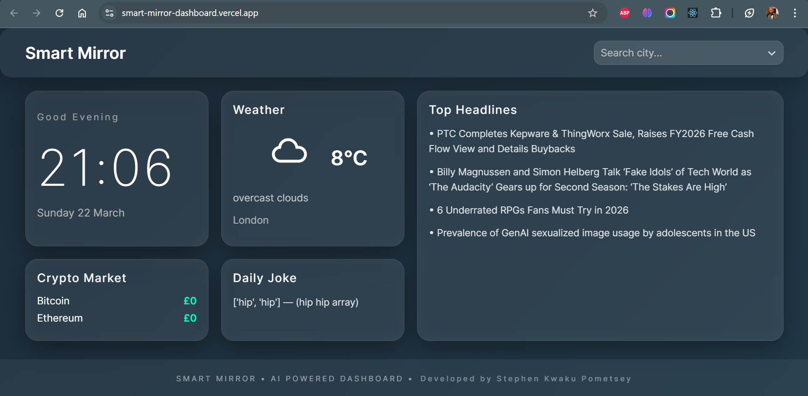
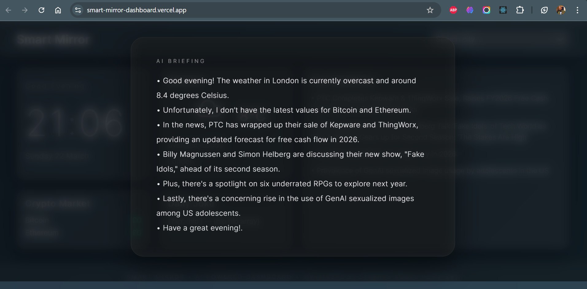
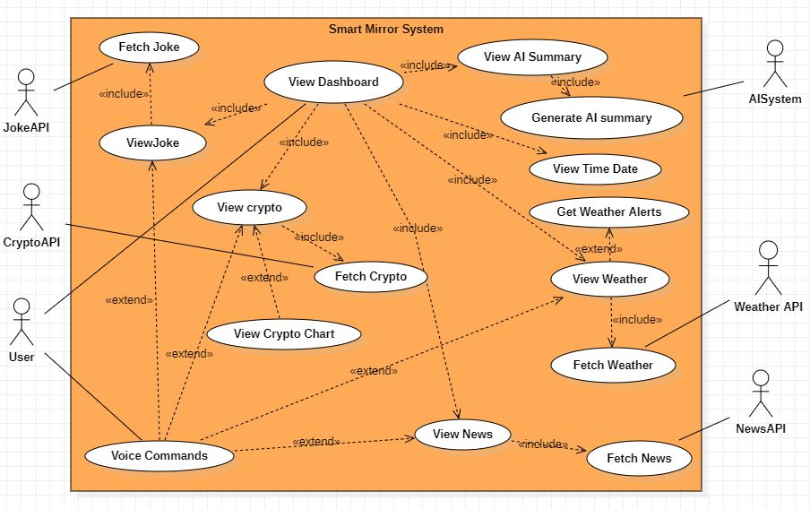
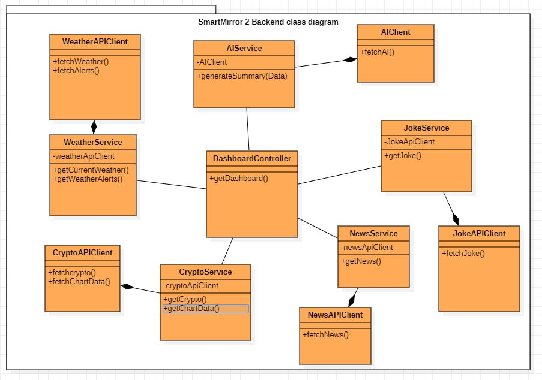
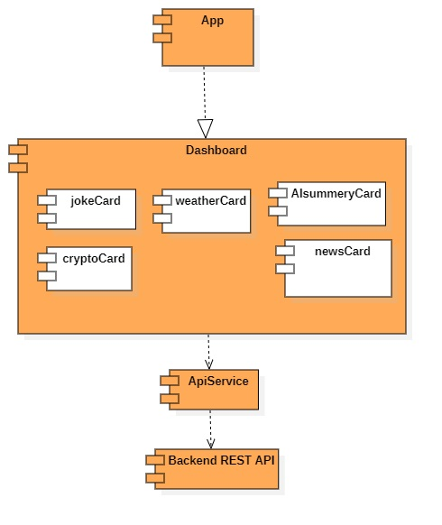
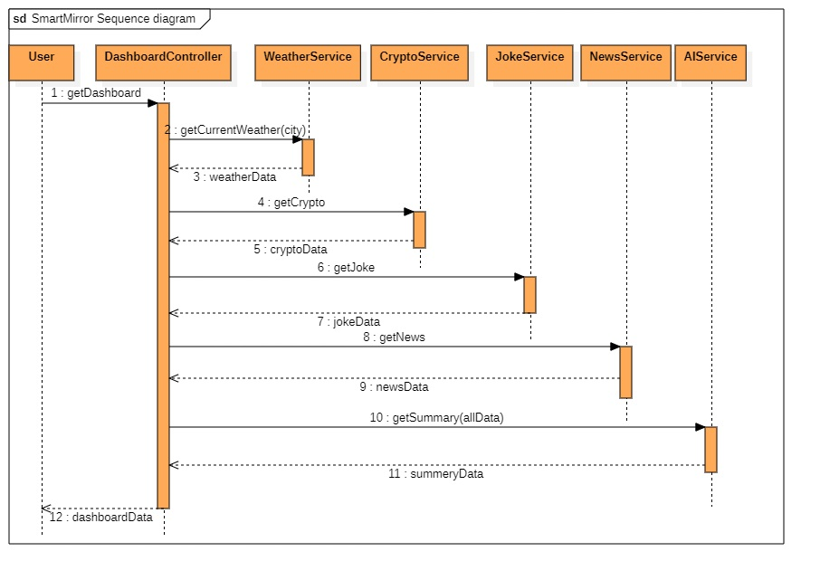

# 🪞 Smart Mirror – AI Powered Dashboard

An intelligent smart mirror dashboard that combines real-time data, AI insights, and voice interaction into a clean, modern interface.

Built with a full-stack architecture using React and Node.js, this project simulates a real-world smart display system.

## 🌐 Live Demo

👉 https://smart-mirror-dashboard.vercel.app/

Experience the Smart Mirror dashboard in real-time.

---

## 🚀 Features

- ⏰ Live Clock with timezone support  
- 🌤 Real-time Weather Updates  
- 💰 Crypto Prices (Bitcoin & Ethereum in GBP)  
- 📰 News Headlines
- 😂 Daily Joke Generator  
- 🧠 AI Insight Briefing  
- 🔊 Voice Output (Text-to-Speech)  
- 🔄 Auto-refresh Dashboard (every 5 minutes)  
- 🌍 Dynamic City Switching  

## 📸 Dashboard Preview

### Main Dashboard



### AI Insight Popup




## 🏗️ System Architecture

This project follows a **client-server architecture** with API aggregation.

```bash
React Frontend
│
▼
Node.js Express Backend
│
├── Weather API (OpenWeather)
├── Crypto API (CoinGecko)
├── News API (GNews)
└── Joke API
```

## 📁 Project Structure

```bash
smart-mirror/
│
├── client/              # React frontend
│   ├── components/
│   └── App.jsx
│
├── server/              # Node.js backend
│   ├── controllers/
│   ├── routes/
│   └── services/
│
├── docs/                # Project documentation
│   ├── system-design/
│   └── diagrams/
│
└── README.md
```
## 📘 Documentation

## 📘 System Design

Detailed system design documentation:

👉 [View System Design](docs/system-design.md)

## 📐 System Design Diagrams

### 🧩 Use Case Diagram


### 🏗 Class Diagram


### 🧱 Component Diagram


### 🔄 Sequence Diagram


## 🧠 AI Briefing Example

> "Good evening Stephen.  
> It's cloudy in London with 12 degrees.  
> Bitcoin is trading at £52,459 today.  
> Here are your top headlines."


## ⚙️ Installation & Setup

### Clone Repository

git clone https://github.com/steveelorm80/smart-mirror.git
cd smart-mirror

Backend Setup:
cd server
npm install
npm start

Frontend Setup:
cd client
npm install
npm run dev
🌐 Live API
https://smart-mirror-api.onrender.com/api/dashboard?city=London

🎯 How It Works
Frontend requests dashboard data
Backend aggregates multiple APIs
Data is processed and structured
AI generates a natural language summary
UI displays and speaks the insight


💡 Future Improvements
🎤 Voice commands
📊 Crypto trend charts
🌙 Night mode
🧍 Face recognition
📱 Mobile app version
⭐ Support

If you like this project, give it a ⭐ on GitHub!


🧑‍💻 Author

Stephen Kwaku Pometsey