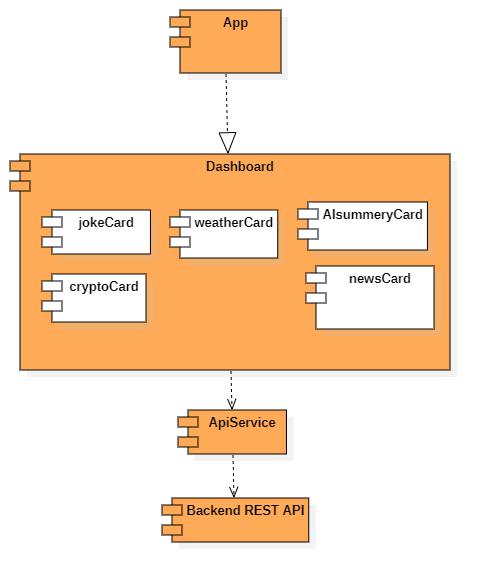
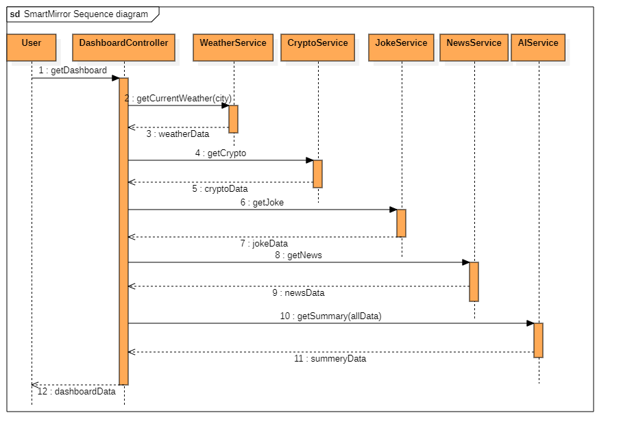

# 📐 Smart Mirror System Design

This document describes the architecture, components, and interaction flow of the Smart Mirror AI Dashboard system.

---

## 🏗️ 1. System Overview

The Smart Mirror system follows a **client-server architecture**.

- **Frontend (React):** Handles UI and user interaction  
- **Backend (Node.js / Express):** Aggregates and processes data  
- **External APIs:** Provide weather, crypto, news, and joke data  
- **AI Service:** Generates a natural language summary  

---

## 🧩 2. Use Case Diagram

### Description

The use case diagram illustrates how the user interacts with the system.

Key interactions include:

- Viewing dashboard information  
- Fetching weather, crypto, news, and jokes  
- Receiving AI-generated summaries  
- (Optional) Voice interaction  

The system integrates multiple APIs while presenting a unified dashboard experience.

---

## 🏗️ 3. Class Diagram

### Description

The backend is structured using a **service-based architecture**:

- `DashboardController` acts as the central coordinator  
- Each service (Weather, Crypto, News, Joke) handles a specific domain  
- API clients manage communication with external services  
- `AIService` generates a summary using aggregated data  

This separation ensures:

- modularity  
- scalability  
- easier maintenance  

---

## 🧱 4. Component Diagram

### Description

The system is divided into three main layers:

1. **Frontend Layer**
   - React components (weather, crypto, news, AI insight)

2. **Service Layer**
   - API service handles communication with backend

3. **Backend Layer**
   - REST API processes requests and aggregates data  

This layered architecture promotes separation of concerns.

---

## 🔄 5. Sequence Diagram

### Description

The sequence diagram shows how data flows through the system:

1. User opens the dashboard  
2. Frontend sends request to backend  
3. Backend controller calls multiple services:
   - WeatherService  
   - CryptoService  
   - NewsService  
   - JokeService  
4. Services fetch data from external APIs  
5. AIService generates a summary  
6. Backend returns aggregated data  
7. Frontend renders UI and triggers voice output  

---

## 🧠 6. Design Decisions

### Why Client-Server Architecture?

- Enables separation between UI and data processing  
- Allows backend to handle API aggregation efficiently  

### Why Service-Based Backend?

- Each service handles a specific responsibility  
- Improves maintainability and scalability  

### Why API Aggregation?

- Reduces frontend complexity  
- Improves performance by consolidating requests  

---

## 🚀 7. Future Improvements

- Add caching (Redis) for faster responses  
- Introduce authentication for personalization  
- Add real-time updates using WebSockets  
- Implement voice command processing  
- Extend AI capabilities for predictive insights  

---

## 📌 Summary

The Smart Mirror system is designed as a modular, scalable, and extensible application that integrates multiple data sources and presents them through a unified intelligent interface.